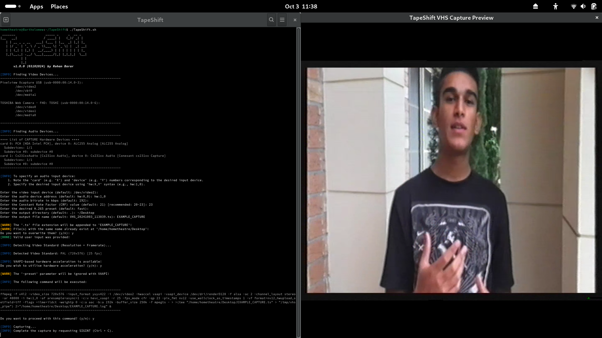
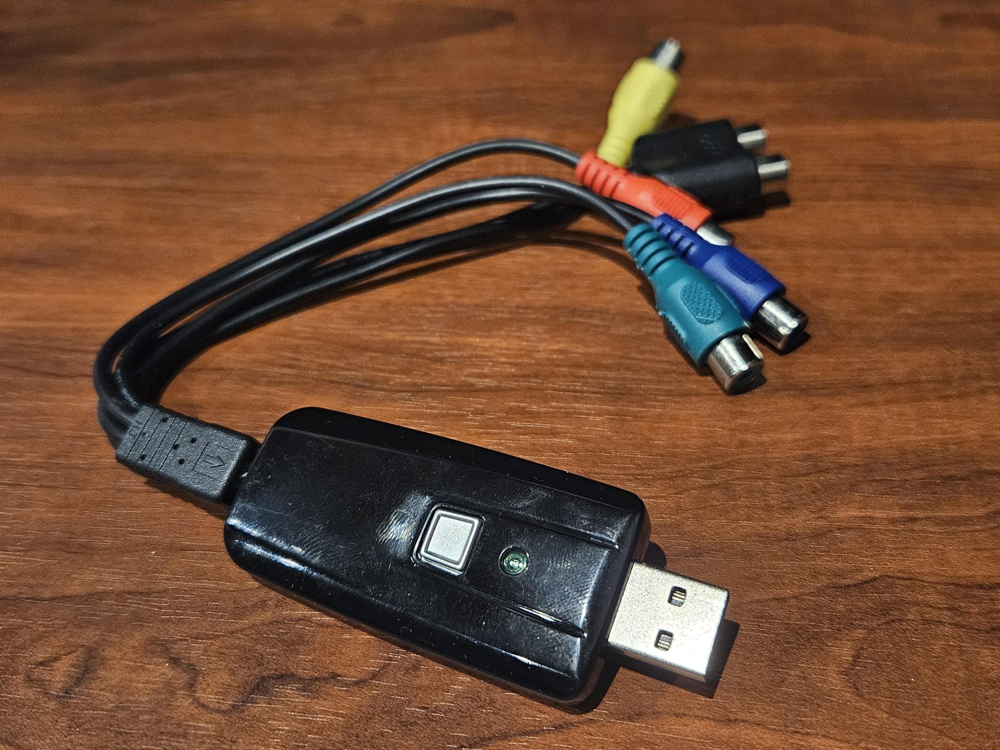

# Tape*Shift*
__VHS Video Digitisation on GNU/Linux via USB Device 1D19:6108 (Dexatek Technology Ltd. Video Grabber)__

## Overview
This project provides software and comprehensive instructions for using the USB device 1D19:6108 (Dexatek Technology Ltd. Video Grabber) to perform VHS video digitisation on Linux. Originally sold by ALDI Australia around 2013 as part of the BAUHN DVD Maker (DK8723), this device functions as a composite and component video capture card.

## Motivation
The motivation for this project arises from the need to breathe new life into this hardware. The official software that came with the device was severely outdated and limited, featuring:

* A Windows XP-era kernel-mode driver 😨
* Archaic, proprietary 'ArcSoft ShowBiz' software 🤮
* No official support for Windows versions beyond Windows 7 👴🏻
* No support for GNU/Linux 😭

## Features
This project leverages `FFMPEG` and `V4L2` in the backend, ensuring efficient and high-quality video processing.

Key features include:
* Ability to digitise copy-protected VHS tapes (unlike 'ArcSoft ShowBiz').
* Capture preview window.
* Support for Video Acceleration API (VAAPI).
* Preservation of interlacing.
* Detailed logging for painless debugging.
* Written in `bash` for easy customisation.

## Installation & Usage
1. Install the required dependencies.
    ```bash
    sudo dnf install ffmpeg v4l-utils alsa-utils
    ```

2. Clone the GitHub repository.
    ```bash
    git clone https://github.com/KernelGhost/TapeShift.git
    cd TapeShift
    ```

3. Plug in the 'Dexatek Technology Ltd. Video Grabber (1D19:6108)'.

4. Run the script.
    ```bash
    ./TapeShift.sh
    ```

## Patching `cx231xx`
Although [a patch has been submitted to add support for '1D19:6108'](https://lore.kernel.org/linux-media/20240926235048.283608-2-rohan.barar@gmail.com/T/#u), for the time being the `cx231xx` driver must be manually modified, compiled and signed.

1. Install the required development tools.

    ```bash
    sudo dnf groupinstall "Development Tools" "Development Libraries"
    sudo dnf install kernel-devel kernel-headers
    ```

2. Initialise a bare git repository.

    ```bash
    git init cx231xx_patch
    cd cx231xx_patch
    ```

3. Enable the sparse checkout feature.

    ```bash
    git config core.sparseCheckout true
    ```

4. Add the Linux kernel source repository URL as the remote.

    ```bash
    git remote add origin https://git.kernel.org/pub/scm/linux/kernel/git/torvalds/linux.git
    ```

5. Define the specific directories to clone in the sparse checkout.

    ```bash
    echo "drivers/media/tuners/" >> .git/info/sparse-checkout
    echo "drivers/media/dvb-frontends/" >> .git/info/sparse-checkout
    echo "drivers/media/usb/cx231xx/" >> .git/info/sparse-checkout
    ```

6. Pull the data from the remote repository.

    ```bash
    git fetch --depth 1 origin
    git checkout origin/master
    ```

7. Using your favourite text editor, modify `drivers/media/usb/cx231xx/cx231xx-cards.c` to include USB device ID `1D19:6108`.

    Before:

    ```c
     /* table of devices that work with this driver */
    struct usb_device_id cx231xx_id_table[] = {
        {USB_DEVICE(0x1D19, 0x6109),
        .driver_info = CX231XX_BOARD_PV_XCAPTURE_USB},
    ```

    After:

    ```c
    /* table of devices that work with this driver */
    struct usb_device_id cx231xx_id_table[] = {
        {USB_DEVICE(0x1D19, 0x6108),
        .driver_info = CX231XX_BOARD_PV_XCAPTURE_USB},
        {USB_DEVICE(0x1D19, 0x6109),
        .driver_info = CX231XX_BOARD_PV_XCAPTURE_USB},
    ```

8. Create the following `Makefile` at `drivers/media/usb/cx231xx/Makefile`. Ensure that TABs are used instead of 4 spaces within the 'all:' and 'clean:' sections.

    ```
    # cx231xx driver makefile for out-of-tree compilation

    KERNEL_DIR ?= /lib/modules/$(shell uname -r)/build
    PWD := $(shell pwd)

    obj-m += cx231xx.o
    cx231xx-y += cx231xx-video.o cx231xx-i2c.o cx231xx-cards.o cx231xx-core.o
    cx231xx-y += cx231xx-avcore.o cx231xx-417.o cx231xx-pcb-cfg.o cx231xx-vbi.o
    cx231xx-$(CONFIG_VIDEO_CX231XX_RC) += cx231xx-input.o

    cx231xx-alsa-objs := cx231xx-audio.o

    obj-$(CONFIG_VIDEO_CX231XX_ALSA) += cx231xx-alsa.o
    obj-$(CONFIG_VIDEO_CX231XX_DVB) += cx231xx-dvb.o

    ccflags-y += -I $(src)/../../tuners
    ccflags-y += -I $(src)/../../dvb-frontends

    all:
        make -C $(KERNEL_DIR) M=$(PWD) modules

    clean:
        make -C $(KERNEL_DIR) M=$(PWD) clean
    ```

9. Run `make` from within the `drivers/media/usb/cx231xx` directory. The output should resemble:

    ```
    make -C /lib/modules/6.10.10-200.fc40.x86_64/build M=/home/rohanbarar/Desktop/cx231xx_patch/drivers/media/usb/cx231xx modules
    make[1]: Entering directory '/usr/src/kernels/6.10.10-200.fc40.x86_64'
    warning: the compiler differs from the one used to build the kernel
      The kernel was built by: gcc (GCC) 14.2.1 20240801 (Red Hat 14.2.1-1)
      You are using:           gcc (GCC) 14.2.1 20240912 (Red Hat 14.2.1-3)
      CC [M]  /home/rohanbarar/Desktop/cx231xx_patch/drivers/media/usb/cx231xx/cx231xx-video.o
      CC [M]  /home/rohanbarar/Desktop/cx231xx_patch/drivers/media/usb/cx231xx/cx231xx-i2c.o
      CC [M]  /home/rohanbarar/Desktop/cx231xx_patch/drivers/media/usb/cx231xx/cx231xx-cards.o
      CC [M]  /home/rohanbarar/Desktop/cx231xx_patch/drivers/media/usb/cx231xx/cx231xx-core.o
      CC [M]  /home/rohanbarar/Desktop/cx231xx_patch/drivers/media/usb/cx231xx/cx231xx-avcore.o
      CC [M]  /home/rohanbarar/Desktop/cx231xx_patch/drivers/media/usb/cx231xx/cx231xx-417.o
      CC [M]  /home/rohanbarar/Desktop/cx231xx_patch/drivers/media/usb/cx231xx/cx231xx-pcb-cfg.o
      CC [M]  /home/rohanbarar/Desktop/cx231xx_patch/drivers/media/usb/cx231xx/cx231xx-vbi.o
      CC [M]  /home/rohanbarar/Desktop/cx231xx_patch/drivers/media/usb/cx231xx/cx231xx-input.o
      LD [M]  /home/rohanbarar/Desktop/cx231xx_patch/drivers/media/usb/cx231xx/cx231xx.o
      CC [M]  /home/rohanbarar/Desktop/cx231xx_patch/drivers/media/usb/cx231xx/cx231xx-audio.o
      LD [M]  /home/rohanbarar/Desktop/cx231xx_patch/drivers/media/usb/cx231xx/cx231xx-alsa.o
      CC [M]  /home/rohanbarar/Desktop/cx231xx_patch/drivers/media/usb/cx231xx/cx231xx-dvb.o
      MODPOST /home/rohanbarar/Desktop/cx231xx_patch/drivers/media/usb/cx231xx/Module.symvers
      CC [M]  /home/rohanbarar/Desktop/cx231xx_patch/drivers/media/usb/cx231xx/cx231xx.mod.o
      LD [M]  /home/rohanbarar/Desktop/cx231xx_patch/drivers/media/usb/cx231xx/cx231xx.ko
      BTF [M] /home/rohanbarar/Desktop/cx231xx_patch/drivers/media/usb/cx231xx/cx231xx.ko
    Skipping BTF generation for /home/rohanbarar/Desktop/cx231xx_patch/drivers/media/usb/cx231xx/cx231xx.ko due to unavailability of vmlinux
      CC [M]  /home/rohanbarar/Desktop/cx231xx_patch/drivers/media/usb/cx231xx/cx231xx-alsa.mod.o
      LD [M]  /home/rohanbarar/Desktop/cx231xx_patch/drivers/media/usb/cx231xx/cx231xx-alsa.ko
      BTF [M] /home/rohanbarar/Desktop/cx231xx_patch/drivers/media/usb/cx231xx/cx231xx-alsa.ko
    Skipping BTF generation for /home/rohanbarar/Desktop/cx231xx_patch/drivers/media/usb/cx231xx/cx231xx-alsa.ko due to unavailability of vmlinux
      CC [M]  /home/rohanbarar/Desktop/cx231xx_patch/drivers/media/usb/cx231xx/cx231xx-dvb.mod.o
      LD [M]  /home/rohanbarar/Desktop/cx231xx_patch/drivers/media/usb/cx231xx/cx231xx-dvb.ko
      BTF [M] /home/rohanbarar/Desktop/cx231xx_patch/drivers/media/usb/cx231xx/cx231xx-dvb.ko
    Skipping BTF generation for /home/rohanbarar/Desktop/cx231xx_patch/drivers/media/usb/cx231xx/cx231xx-dvb.ko due to unavailability of vmlinux
    make[1]: Leaving directory '/usr/src/kernels/6.10.10-200.fc40.x86_64'
    ```

10. Copy the compiled driver to the correct location on your system.

    ```bash
    sudo cp ./cx231xx.ko /lib/modules/$(uname -r)/kernel/drivers/media/usb/cx231xx
    ```

11. (Optional) Create and enroll a key pair to sign the compiled driver. If you already have a set of keys, you can skip ahead to the next step.
    1. Install OpenSSH.

        ```bash
        sudo dnf install openssl
        ```

    2. Create a directory to store the keys.

        ```bash
        mkdir -p ~/keys
        cd ~/keys
        ```

    3. Create the keys.

        ```bash
        # Private Key
        openssl genrsa -out private_key_for_cx231xx.priv 2048

        # Public Key
        openssl req -new -x509 -key private_key_for_cx231xx.priv -out public_key_for_cx231xx.der -days 36500 -subj "/CN=Kernel Module Signing"
        ```

    4. Enroll the public key within the UEFI.

        ```bash
        sudo mokutil --import ~/keys/public_key_for_cx231xx.der
        ```

        Note: You will be prompted to create a one-time password. This does not need to be anything complex, and will only be requested once by the 'Perform MOK management' screen within the UEFI when enrolling the certificate (public key). Using something simple like 'a' or '0' as the password is fine.

    5. Reboot the system and follow the prompts at startup to enroll the public key.
        - In the MOK Manager screen, choose "Enroll MOK".
        - Select "Continue" and enter the one-time password you created earlier.
        - Confirm the enrollment to finish the process.

11. (Optional) Sign the driver using your new key pair.

    ```bash
    sudo /usr/src/kernels/$(uname -r)/scripts/sign-file sha256 ~/keys/private_key_for_cx231xx.priv ~/keys/public_key_for_cx231xx.der /lib/modules/$(uname -r)/kernel/drivers/media/usb/cx231xx/cx231xx.ko
    ```

12. Disable the existing copy of the `cx231xx` driver.

    ```bash
    sudo mv /lib/modules/$(uname -r)/kernel/drivers/media/usb/cx231xx/cx231xx.ko.xz /lib/modules/$(uname -r)/kernel/drivers/media/usb/cx231xx/cx231xx.ko.xz.bak
    sudo dracut --force
    ```

13. Unload and reload `cx231xx` to switch to the patched copy of the driver.

    ```bash
    sudo modprobe -r cx231xx # Unload Old Driver
    sudo modprobe cx231xx    # Load Patched Driver
    ```

> [!IMPORTANT]  
> Steps marked as '(Optional)' are mandatory on systems with 'Secure Boot' enabled.
> The process of manually compiling and signing the patched version of the driver will need to be repeated each time the kernel is updated.
> While there are automated solutions available (e.g. DKMS), the method described above serves as a temporary workaround until [my patch](https://lore.kernel.org/linux-media/20240926235048.283608-2-rohan.barar@gmail.com/T/#u) is merged into the `cx231xx` driver.

> [!NOTE]  
> You can easily undo all the above changes and switch back to the default version of the `cx231xx` driver by:
> 1. Using `mv` to rename the default driver back to its original name (remove '.bak').
> 2. Deleting `cx231xx.ko` from `/lib/modules/$(uname -r)/kernel/drivers/media/usb/cx231xx/`.
> 3. Removing the MOK certificate (public key) from the UEFI using `mokutil`. Please only do this if no other kernel modules have been signed using the same key!

## Demonstration


## Sample Video Capture Showcase
https://github.com/KernelGhost/TapeShift/raw/refs/heads/main/Multimedia/Showcase.mp4

## Product Images
<table>
    <tr>
        <td></td>
        <td></td>
        <td></td>
    </tr>
</table>
